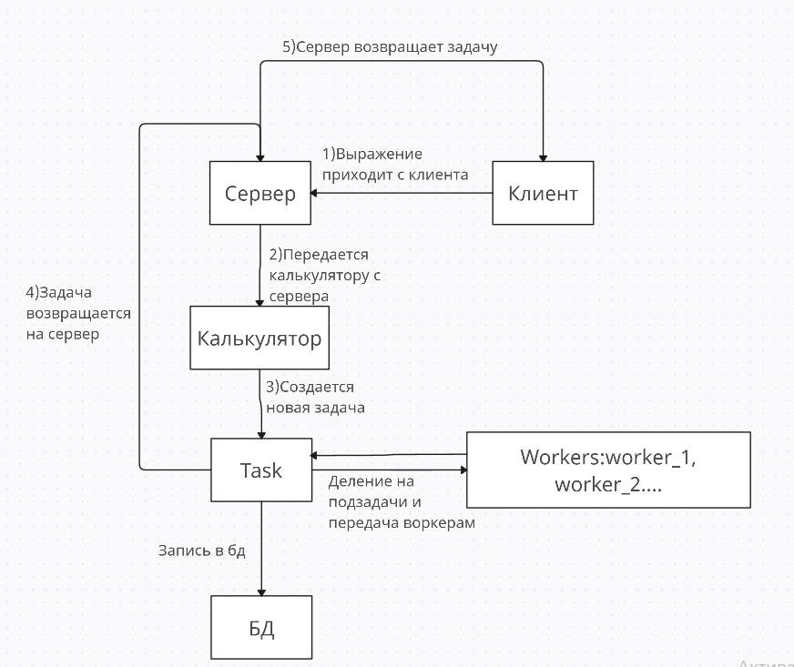

# Калькулятор на Go
## Запуск
### Через Dockerfile
1. Выполняем ```git clone https://github.com/apple5343/golangProjectV2.git``` и переходим в папку с проектом
2. В папке с проектом выполняем ```docker build -t myapp .```
3. Затем нужно запустить командой ```docker run -p 8080:8080 -d -v <путь до проекта>/database:/app/database -v <путь до проекта>/config:/app/config myapp```

Если путь будет указан неверно, то изменения не будут сохраняться в базу данных при перезапускесервер будет запущен по адресу http://localhost:8080/после можно прописать ```docker ps``` для достоверности.

Чтобы проверить работу можно просмотреть логи командой ```docker logs [CONTAINER_ID_OR_NAME]```. CONTAINER_ID_OR_NAME берется из ```docker ps```

Для остановки пишем ```docker stop <CONTAINER ID>```
### Через Go
1. Выполняем ```git clone https://github.com/apple5343/golangProjectV2.git``` и переходим в папку с проектом
2. В папке с проектом выполняем ```go mod tidy```
3. Запускаем файл ```cmd/main.go```
### Через exe файл
1. Выполняем ```git clone https://github.com/apple5343/golangProjectV2.git``` и переходим в папку с проектом
2. Запускаем ```main.exe```
## Функции
1. Допустимые символы: -+/*, можно использовать десятичные числа типа 1.5, деление на 0 выдает ошибку
2. При перезапуске будут выполнятся прерванные операции с последнего состояния
3. Можно просмотреть подробную информацию о задаче
4. Мониторить задержку и состояние воркеров может только админ, чтобы его создать профиль админа при регистрации введити имя ```admin```

## Схема работы
